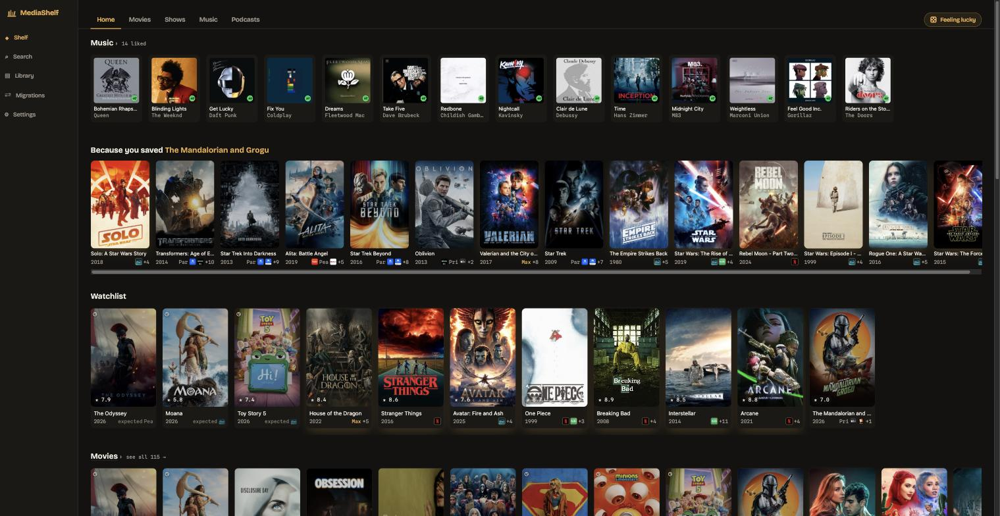
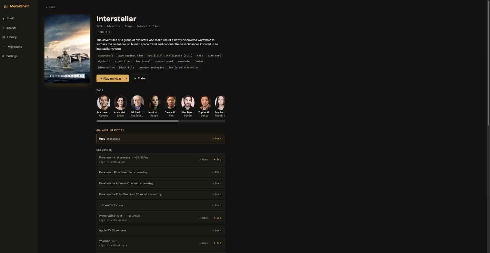

# MediaShelf

A self-hosted streaming index and router: one shelf across your streaming services, split by
what you subscribe to vs what's elsewhere, with working deep links into the owning apps.
Tracks availability across **Netflix, Prime Video, Disney+, Max, Hulu, Apple TV+, Paramount+,
Peacock, Crunchyroll — and 200+ more services worldwide**, per region.

MediaShelf never stores, serves, or plays media files. DRM services are browse-and-link only.



- 🗄️ **Self-hosted** — one Docker container, your own API keys, your data stays yours
- 📡 **Netflix, Prime Video, Disney+, Max, Hulu, Apple TV+ and 200+ more** tracked worldwide
  with per-region availability — deep integrations for Spotify, YouTube & Apple Music
- 💡 **Lit vs dimmed** — instantly see what's watchable on services you already pay for
- 🎵 **Cross-service music** — Spotify + YouTube Music + Apple Music in one continuous queue;
  a track that can't play on one service resolves to the best match on another
- 🔀 **Migrations** — move playlists & likes between music services, reviewable and revertible
- 🎙️ **Podcasts** (RSS/OPML) · 📱 installable **PWA** with offline shell · 🌐 11 languages
- 🎲 **Feeling lucky** — pick a genre and a time limit, roll, and get something random you
  can watch *right now* on your services

<details>
<summary>More screenshots</summary>

**Title page** — the money shot: on your services vs elsewhere, deep links, plan prices, cast:



</details>

## In detail

- **One lit shelf** across your services — titles you can watch on what you subscribe to are
  lit; everything else is dimmed, each with working deep links into the owning app.
- **Universal search** over movies/TV (TMDB) and music — Spotify, YouTube Music (via the
  optional yt-dlp plugin) and Apple Music catalogs — fanned out per source; each source is
  optional and lights up when its key is added.
- **Accounts & in-app playback** — connect Spotify / YouTube / Apple Music with your own keys;
  video is browse-and-link only (never DRM playback).
- **Matching engine & migrations** — move playlists/likes/follows between music services, with a
  reviewable, revertible job log.
- **Per-region availability** — the same title can stream on different services by country, and
  the shelf reflects the region you pick.
- **Media-type tabs** (All / Movies / Shows / Music) and a personal **Watchlist** rail imported
  from your streaming apps via a separate local companion tool (logged-in scraping stays out of
  the product).
- **"Popular right now"** aggregated from per-service Top 10s, **IMDb/RT/Metacritic** ratings
  (optional, via OMDb) alongside TMDB scores, service logos on every card, and studio-inferred
  **"expected on X"** hints for upcoming titles that aren't streaming yet.
- **Podcasts** — subscribe by RSS feed URL or bulk-import an OPML file from any other app;
  episodes stream in-app and auto-advance through the show. No account, no API key, no setup.
- **Display language** — the interface follows a locale you pick (or your browser's), independent
  of your content region; dates and numbers format to match.
- **Installable PWA** — add it to your phone or desktop home screen; the app shell is cached for
  instant loads and offline shell rendering (live data still needs the network).

- **Optional `yt-dlp`** metadata provider — zero-quota YouTube search behind a detected,
  off-by-default toggle (Settings → Plugins).

**Milestones M1–M8 complete** (skeleton, search, accounts/playback, matching, migrations,
yt-dlp, concierge & a11y polish, podcasts) plus i18n and PWA installability. M9 (social/feed
layer) is deferred.

## Quick start (Docker)

Prebuilt image (no build):

```sh
docker run -d -p 8000:8000 -v mediashelf-data:/data --restart unless-stopped \
  ghcr.io/ghltshubh/mediashelf:latest
```

Or build from source:

```sh
docker compose -f docker/compose.yaml up --build -d
```

Open http://localhost:8000 — onboarding asks for your own free TMDB API key
(create one at https://www.themoviedb.org/settings/api) and your country, then lets you tick
the services you subscribe to. That's all the app needs.

**→ Full setup, key-by-key: see [docs/INSTALL.md](docs/INSTALL.md)** — step-by-step for every API
key, connecting Spotify / YouTube / Apple, the optional yt-dlp plugin, remote hosting, and
troubleshooting.

Your data (SQLite DB, encrypted API keys, backups) lives in the `mediashelf-data` volume.

## Quick start (development)

```sh
# Backend
python3.12 -m venv .venv && .venv/bin/pip install -e ".[dev]"
.venv/bin/uvicorn app.main:app --reload            # http://localhost:8000

# Frontend (separate terminal; proxies /api to :8000)
cd app/web && npm install && npm run dev            # http://localhost:5173
```

Checks: `.venv/bin/pytest` · `.venv/bin/ruff check app tests` · `.venv/bin/mypy app`
Component demo page (dev builds): http://localhost:5173/dev/components

## Connecting accounts & keys

All keys are **your own** — nothing is shared or embedded. Only **TMDB is required**; everything
else is optional and unlocks a specific feature. Enter them in **Settings → Keys**; connect the
OAuth accounts in **Settings → Accounts**. The OAuth redirect URI is always
`http://127.0.0.1:8000/oauth2callback`.

| Provider | Unlocks | How to get it |
|---|---|---|
| **TMDB** (required) | the whole catalog + availability | [themoviedb.org/settings/api](https://www.themoviedb.org/settings/api) → request a key (v3 key or v4 read token both work) |
| **OMDb** (optional) | IMDb / Rotten Tomatoes / Metacritic ratings | [omdbapi.com/apikey.aspx](https://www.omdbapi.com/apikey.aspx) → free key by email, click the activation link |
| **Spotify** (optional) | music search, in-app playback (Premium), migration | [developer.spotify.com/dashboard](https://developer.spotify.com/dashboard) → create app → add the redirect URI above → copy Client ID + Secret |
| **YouTube / Google** (optional) | subscriptions + liked-video sync, migration, cheaper reads | [console.cloud.google.com](https://console.cloud.google.com) → new project → enable **YouTube Data API v3** → OAuth consent screen (External; add yourself as a test user) → Credentials → **OAuth client ID (Web application)** with the redirect URI above → copy Client ID + Secret |
| **Apple Music** (optional) | Apple Music in the playback chain | paid Apple Developer account → generate a **MusicKit developer token** (JWT) and paste it |
| **yt-dlp** (optional plugin) | zero-quota YouTube search | `pipx install yt-dlp` (or `pip install yt-dlp`), then enable it in **Settings → Plugins** |

**Add-on channels** (Prime Video Channels, Apple TV Channels, Roku Premium Channels) appear as
their own services in the checklist (e.g. "HBO Max Amazon Channel") — tick whichever way you
actually subscribe, and titles light up accordingly.

**Watchlist import** ("My List" from Netflix/Tubi/etc.) runs as a **separate local companion tool**,
not part of this product — logged-in scraping stays outside the core per the plugin boundary.

## Notes

- **Your own API keys.** MediaShelf never ships or embeds shared keys; setup walks you through
  creating your own. Only a TMDB key is required; connectors (Spotify/YouTube/Apple) and the
  optional OMDb ratings key are added when you want those features.
- **Secrets** are encrypted at rest (NaCl SecretBox; per-install key in the data dir) and never logged.
- **Backups**: nightly SQLite backups (keeps 7) in the data dir; Settings → About has one-click
  export/import; a corrupt DB is auto-restored from the latest good backup on boot.
- **Failure behavior**: if TMDB is unreachable or your key is revoked, the last-synced catalog
  keeps serving with a banner naming its age and the fix.
- This product uses the TMDB API but is not endorsed or certified by TMDB.

## License & support

MediaShelf is licensed under the **GNU AGPL-3.0-or-later** — see [LICENSE](LICENSE).
Self-host it freely; if you offer a modified version as a network service, you must share your
changes under the same license. Commercial licensing is available from the copyright holder.

If MediaShelf is useful to you:
[](https://buymeacoffee.com/shubhankar)
