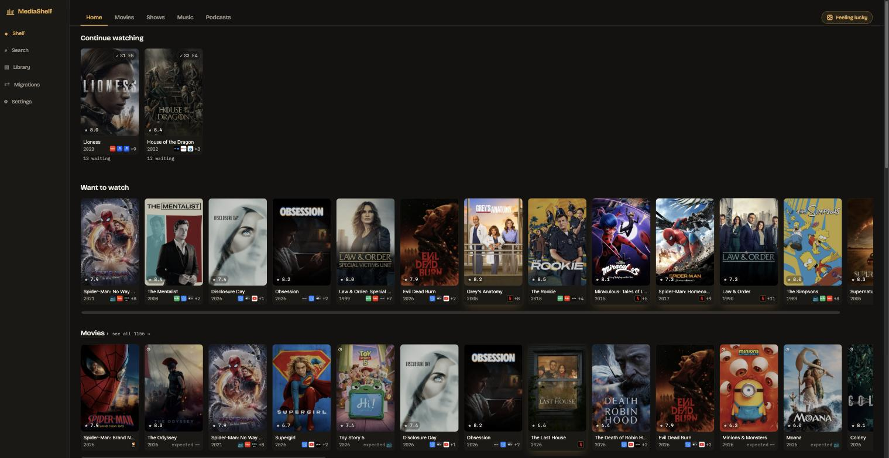
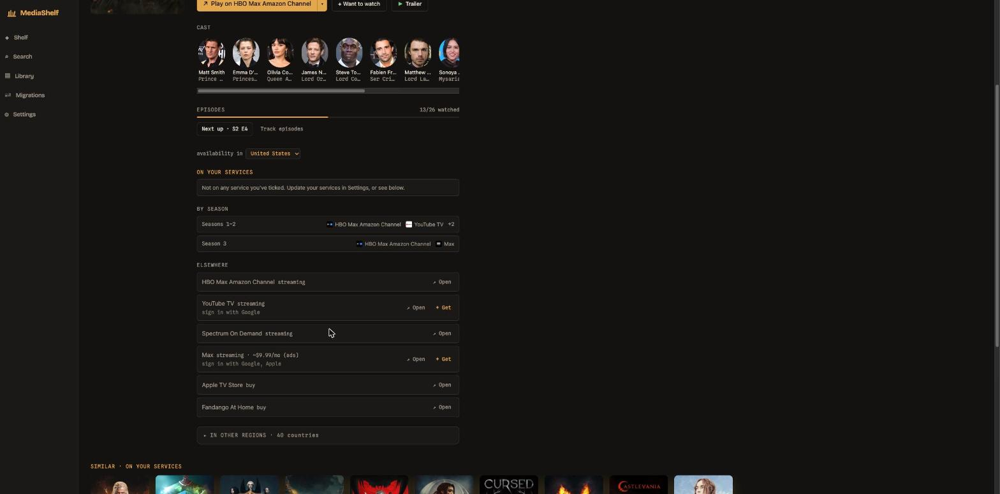
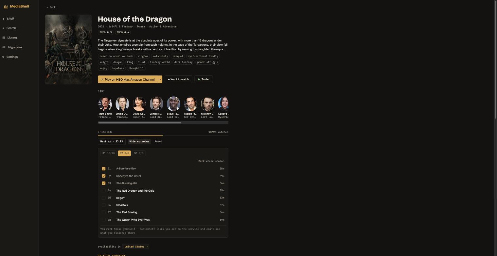

# MediaShelf

**[mediashelf website →](https://www.tinkerer.in/mediashelf/)**

A self-hosted streaming index and router: one shelf across your streaming services, split by
what you subscribe to vs what's elsewhere, with working deep links into the owning apps.
Tracks availability across **Netflix, Prime Video, Disney+, Max, Hulu, Apple TV+, Paramount+,
Peacock, Crunchyroll — and 200+ more services worldwide**, per region.

MediaShelf never stores, serves, or plays media files. DRM services are browse-and-link only.



- 🗄️ **Self-hosted** — one Docker container, your own API keys, your data stays yours
- 📡 **Netflix, Prime Video, Disney+, Max, Hulu, Apple TV+ and 200+ more** tracked worldwide
  with per-region availability — deep integrations for Spotify, YouTube & Apple Music
- 💡 **Lit vs dimmed** — instantly see what's watchable on services you already pay for
- 🎵 **Cross-service music** — Spotify + YouTube Music + Apple Music in one continuous queue;
  a track that can't play on one service resolves to the best match on another
- 🔀 **Migrations** — move playlists & likes between music services, reviewable and revertible
- 🎙️ **Podcasts** (RSS/OPML) · 📱 installable **PWA** with offline shell · 🌐 11 languages
- 🎲 **Feeling lucky** — pick a genre and a time limit, roll, and get something random you
  can watch *right now* on your services
- 🧩 **Bring your watchlist with you** — a companion
  [browser extension](https://github.com/ghltshubh/mediashelf-clipper/releases/latest) copies your
  **"My List"** across from Netflix, Prime Video, Disney+ and 7 more, in one click

<details>
<summary>More screenshots</summary>

**Title page** — where a title streams (on your services vs elsewhere), deep links, plan
prices, and cast, with the episode list open beside it. Shows whose seasons sit on different
services get a **by season** breakdown:



**Episode tracking** — the season list is right there on the page; tick episodes or a whole
season, and the shelf's "Continue watching" rail picks up from there:



</details>

## In detail

- **One lit shelf** across your services — titles you can watch on what you subscribe to are
  lit; everything else is dimmed, each with working deep links into the owning app.
- **Universal search** over movies/TV (TMDB) and music — Spotify, YouTube Music (via the
  optional yt-dlp plugin) and Apple Music catalogs — fanned out per source; each source is
  optional and lights up when its key is added.
- **Accounts & in-app playback** — connect Spotify / YouTube / Apple Music with your own keys;
  video is browse-and-link only (never DRM playback).
- **Matching engine & migrations** — move playlists/likes/follows between music services, with a
  reviewable, revertible job log.
- **Per-region and worldwide availability** — the same title can stream on different services
  by country. Track any number of countries (search and the shelf carry region-tagged results
  across all of them, at zero extra TMDB cost), switch region anywhere, and every title page can
  expand **"In other regions"** to show where it streams in every country worldwide — for when
  something isn't available where you live.
- **Media-type tabs** (All / Movies / Shows / Music) and a **"Want to watch"** rail — save titles
  from any title page, bring an existing list in via Settings (paste titles or upload a
  `.txt`/`.csv`: official service data exports, Letterboxd/IMDb exports, hand-written lists), or
  copy your **"My List"** over from ten streaming services with the companion
  [browser extension](https://github.com/ghltshubh/mediashelf-clipper/releases/latest).
- **Episode tracking** for shows — the season list sits open on every show's page: tick episodes
  or whole seasons, and a **"Continue watching"**
  rail leads the shelf with a one-tap mark for the next episode. Shows sort themselves into not
  started / watching / caught up / seen, so a running show you're up to date on steps aside until
  a new episode airs. Marking is manual: MediaShelf links out to the service and never sees
  playback, so nothing can report an episode finished on its own.
- **Overseerr / Jellyseerr** — if you self-host a request pipeline, a title that isn't on any
  service you've ticked gets a **Request on Seer** button pointing at your own instance. Both are
  TMDB-keyed like MediaShelf, so the link lands on the exact title. Configure the base
  URL in Settings → Plugins; MediaShelf only links out — it never sends the request or touches
  media, and without that setting the button doesn't exist.
- **"Trending this week"** straight from TMDB, and **"Popular right now"** from the weekly
  Top 10 **Netflix itself publishes as open data** — both refresh with the nightly sync on a
  stock install, no extra key, no tooling. (Other services publish no equivalent; their
  per-service views rank by TMDB popularity instead.)
- **IMDb/RT/Metacritic** ratings (optional, via OMDb) alongside TMDB scores, service logos on
  every card, and studio-inferred **"expected on X"** hints for upcoming titles.
- **Podcasts** — subscribe by RSS feed URL or bulk-import an OPML file from any other app;
  episodes stream in-app and auto-advance through the show. No account, no API key, no setup.
- **Display language** — the interface follows a locale you pick (or your browser's), independent
  of your content region; dates and numbers format to match.
- **Installable PWA** — add it to your phone or desktop home screen; the app shell is cached for
  instant loads and offline shell rendering (live data still needs the network).

- **Optional `yt-dlp`** metadata provider — zero-quota YouTube search behind a detected,
  off-by-default toggle (Settings → Plugins).

**Milestones M1–M8 complete** (skeleton, search, accounts/playback, matching, migrations,
yt-dlp, concierge & a11y polish, podcasts) plus i18n and PWA installability. M9 (social/feed
layer) is deferred.

**→ What's next, and what isn't: [ROADMAP.md](ROADMAP.md).**

## Quick start

Two steps to a working shelf. The third is optional and takes a minute.

### 1 · Run it 🐳

```sh
docker run -d -p 8000:8000 -v mediashelf-data:/data --restart unless-stopped \
  ghcr.io/ghltshubh/mediashelf:latest
```

<sub>Prefer to build it yourself? `docker compose -f docker/compose.yaml up --build -d`</sub>

### 2 · Set it up 🔑

Open **http://localhost:8000**. Onboarding asks for two things: your own free
[TMDB API key](https://www.themoviedb.org/settings/api) and your country. Then tick the services
you subscribe to.

**That is the whole setup.** Netflix, Disney+ and the rest have no API to connect to, so ticking
them is all they need. Your data (SQLite DB, encrypted keys, nightly backups) lives in the
`mediashelf-data` volume.

### 3 · Bring your watchlist over 🧩 *(optional)*

[](https://github.com/ghltshubh/mediashelf-clipper/releases/latest)
[](https://github.com/ghltshubh/mediashelf-clipper/releases/latest)

The companion **[MediaShelf clipper](https://github.com/ghltshubh/mediashelf-clipper)** copies
your existing **"My List"** into MediaShelf from Netflix, Prime Video, Disney+, Hulu, Max,
Paramount+, Peacock, Tubi, Crunchyroll and Apple TV+. Open your list on that service, click the
toolbar icon, done.

It installs separately and always will: your **browser** is what's signed in to those services,
not your server — a NAS has neither a browser nor your sessions. Nothing in MediaShelf needs it.
Without it you can still save titles with **+ Want to watch** on any title page, or paste/upload
a list in **Settings → Plugins**.

### Optional extras

All off until you fill them in — nothing nags, nothing is broken for leaving them blank:

| Optional | What it adds | Where |
|---|---|---|
| Spotify / YouTube / Apple Music keys | in-app playback and library sync | Settings → Keys |
| OMDb key | IMDb / RT / Metacritic scores | Settings → Keys |
| Overseerr / Jellyseerr URL | a **Request on Seer** button when nothing you subscribe to has a title | Settings → Plugins |
| `yt-dlp` | zero-quota YouTube search | Settings → Plugins |
| Watchlist importer URL | *continuous* "My List" sync via a tool you write yourself — most people want the extension above instead ([§8b](docs/INSTALL.md#8b-watchlist-import-paste-upload-or-an-external-tool)) | Settings → Plugins |

**Running it on a server or NAS?** Two things differ from localhost: the OAuth redirect has to
point at that host, and the extension points at the server's address instead of `127.0.0.1`.
[docs/INSTALL.md §8](docs/INSTALL.md) covers both.

**→ Full setup, key-by-key: see [docs/INSTALL.md](docs/INSTALL.md)** — step-by-step for every API
key, connecting Spotify / YouTube / Apple, the optional yt-dlp plugin, remote hosting, and
troubleshooting.

## Development

```sh
# Backend
python3.12 -m venv .venv && .venv/bin/pip install -e ".[dev]"
.venv/bin/uvicorn app.main:app --reload            # http://localhost:8000

# Frontend (separate terminal; proxies /api to :8000)
cd app/web && npm install && npm run dev            # http://localhost:5173
```

Checks: `.venv/bin/pytest` · `.venv/bin/ruff check app tests` · `.venv/bin/mypy app`
Component demo page (dev builds): http://localhost:5173/dev/components

## Connecting accounts & keys

All keys are **your own** — nothing is shared or embedded. Only **TMDB is required**; everything
else is optional and unlocks a specific feature. Enter them in **Settings → Keys**; connect the
OAuth accounts in **Settings → Accounts**. The OAuth redirect URI defaults to
`http://127.0.0.1:8000/oauth2callback`, which is right when MediaShelf runs on the machine you
browse from. **Running it on a server or NAS? Change it** in Settings → Accounts to that server's
own address ending in `/oauth2callback`, and register the same string with each provider.
Otherwise the provider sends the callback to your laptop, the server never receives the token,
and Connect fails without saying why.

| Provider | Unlocks | How to get it |
|---|---|---|
| **TMDB** (required) | the whole catalog + availability | [themoviedb.org/settings/api](https://www.themoviedb.org/settings/api) → request a key (v3 key or v4 read token both work) |
| **OMDb** (optional) | IMDb / Rotten Tomatoes / Metacritic ratings | [omdbapi.com/apikey.aspx](https://www.omdbapi.com/apikey.aspx) → free key by email, click the activation link |
| **Spotify** (optional) | music search, in-app playback (Premium), migration | [developer.spotify.com/dashboard](https://developer.spotify.com/dashboard) → create app → add the redirect URI above → copy Client ID + Secret |
| **YouTube / Google** (optional) | subscriptions + liked-video sync, migration, cheaper reads | [console.cloud.google.com](https://console.cloud.google.com) → new project → enable **YouTube Data API v3** → OAuth consent screen (External; add yourself as a test user) → Credentials → **OAuth client ID (Web application)** with the redirect URI above → copy Client ID + Secret |
| **Apple Music** (optional) | Apple Music in the playback chain | paid Apple Developer account → generate a **MusicKit developer token** (JWT) and paste it |
| **yt-dlp** (optional plugin) | zero-quota YouTube search | `brew install yt-dlp` (macOS) or `pipx install yt-dlp` — these land it on PATH, which detection requires (a plain `pip install` often doesn't, and search then silently stays off). Enable in **Settings → Plugins** |

**Add-on channels** (Prime Video Channels, Apple TV Channels, Roku Premium Channels) appear as
their own services in the checklist (e.g. "HBO Max Amazon Channel") — tick whichever way you
actually subscribe, and titles light up accordingly.

### Filling your watchlist

Three ways in, all landing in the same **"Want to watch"** rail:

| | How | Good for |
|---|---|---|
| ➕ | **+ Want to watch** on any title page | everyday saving, one title at a time |
| 📋 | **Paste or upload** in Settings → Plugins | a service's official data export, a Letterboxd/IMDb CSV, or a plain `Title (Year)` list — only ever adds |
| 🧩 | **[Browser extension](https://github.com/ghltshubh/mediashelf-clipper/releases/latest)** | copying your existing "My List" across from 10 services in one click |

Titles you save yourself are stored separately from imported ones, so **an import can never
delete them** — an extension clip is a full-state sync of that service's list and nothing else.

The extension isn't part of MediaShelf and won't be: reading a logged-in streaming session is a
decision about *your* account, and it belongs in your browser and your hands rather than running
unattended on a server. Settings → Plugins also takes an **Importer URL** if you write your own
sync tool; leave it empty and those links simply don't appear.

## Notes

- **Your own API keys.** MediaShelf never ships or embeds shared keys; setup walks you through
  creating your own. Only a TMDB key is required; connectors (Spotify/YouTube/Apple) and the
  optional OMDb ratings key are added when you want those features.
- **Secrets** are encrypted at rest (NaCl SecretBox; per-install key in the data dir) and never logged.
- **Backups**: nightly SQLite backups (keeps 7) in the data dir; Settings → About has one-click
  export/import; a corrupt DB is auto-restored from the latest good backup on boot.
- **Failure behavior**: if TMDB is unreachable or your key is revoked, the last-synced catalog
  keeps serving with a banner naming its age and the fix.
- This product uses the TMDB API but is not endorsed or certified by TMDB. Streaming
  availability data is provided by **JustWatch**.

## How this was built

MediaShelf is written with a generative AI code assistant (Anthropic's Claude, through Claude
Code), used across the codebase rather than in one corner of it: application logic, the React
front end, the site readers in the extension, tests and documentation. Every line was directed,
reviewed and tested by a person before it landed, the design decisions are mine, and I can explain
any of them. The commit history is the record of what changed and when.

This note is here so users and contributors know what they are reading, and because funders such
as [NLnet](https://nlnet.nl/foundation/policies/generativeAI/) reasonably ask projects to say so
plainly.

## License & support

MediaShelf is licensed under the **GNU AGPL-3.0-or-later** — see [LICENSE](LICENSE).
Self-host it freely; if you offer a modified version as a network service, you must share your
changes under the same license. Commercial licensing is available from the copyright holder.

If MediaShelf is useful to you:
[](https://github.com/sponsors/ghltshubh)
[](https://buymeacoffee.com/shubhankar)

What the money is for is written down in [funding.json](funding.json), a
[FLOSS/fund](https://floss.fund) manifest: maintenance time, and the small ARM machines the
Docker images are tested on.
